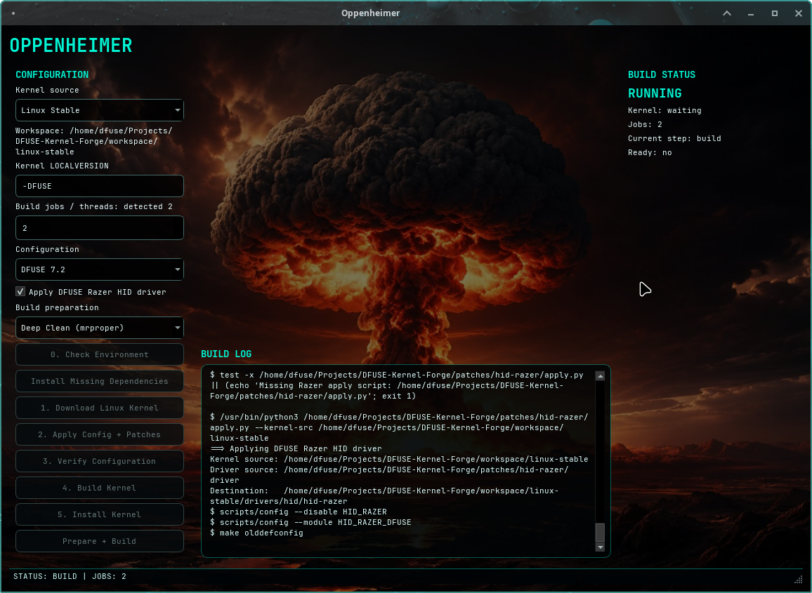
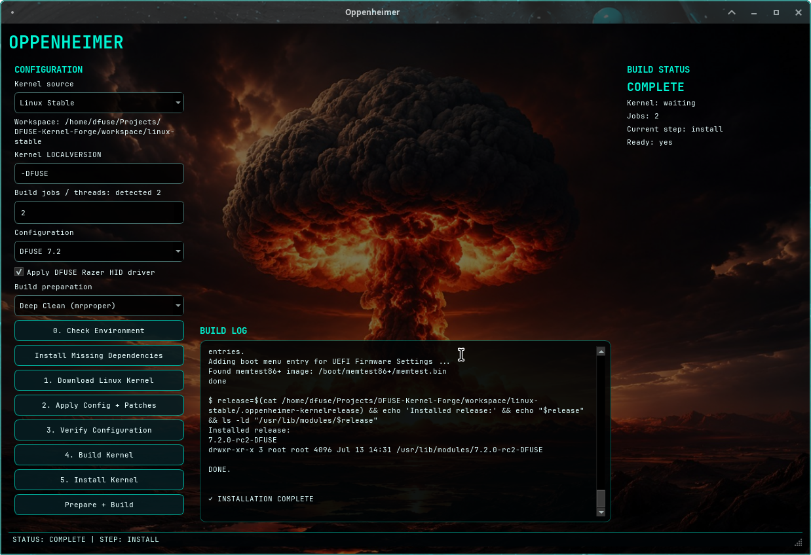
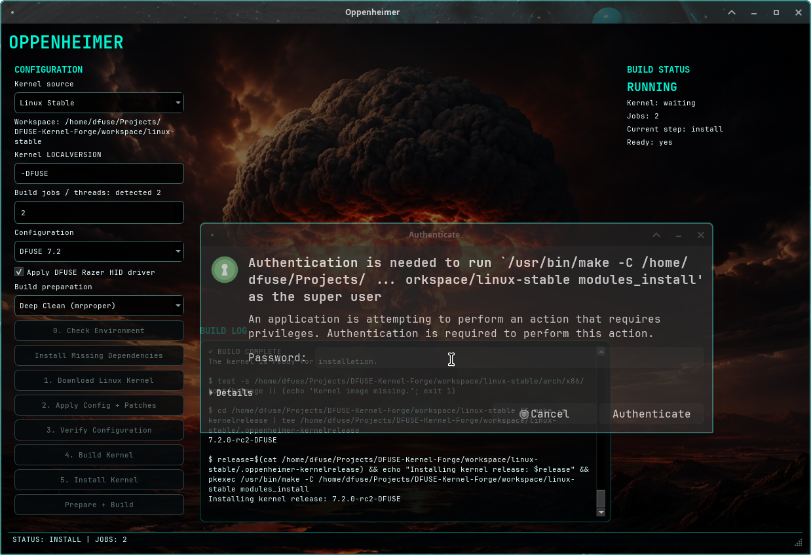

# Oppenheimer

A modern graphical Linux kernel build environment for creating, customizing, and installing Linux kernels with an intuitive desktop interface.

Oppenheimer automates the entire kernel workflow, from downloading Linux Stable to configuring, building, installing, and updating GRUB. It also supports the **DFUSE in-tree Razer HID driver**, eliminating the need for external DKMS modules.

---

# Features

- Modern PySide6 graphical interface
- Automatic Linux Stable source download
- Dependency checker and installer
- Multiple kernel configuration support
- Deep Clean (`make mrproper`)
- Standard Clean (`make clean`)
- Automatic kernel verification
- Parallel kernel compilation
- Automatic module installation
- Automatic kernel installation
- Automatic GRUB update
- Live build log
- Build status monitoring
- Workspace management
- DFUSE Razer HID Driver integration

---

# DFUSE Razer HID Driver

Oppenheimer can build Linux with the **DFUSE in-tree Razer HID driver**.

## Advantages

- No DKMS required
- Native kernel integration
- Faster loading
- Automatic driver registration
- Supports Polychromatic/OpenRazer userspace

### Tested Hardware

- ✅ Razer Cobra
- ✅ Razer Ornata V3 X

---

# Screenshots

## Main Interface



Configure the kernel source, build jobs, configuration, DFUSE Razer integration, and build preparation from a single interface.

---

## Successful Build



Kernel successfully compiled and installed with real-time build logs and installation status.

---

## Automatic Installation



Automatic module installation, kernel deployment, and privileged installation directly from the application.

---

# Requirements

## Arch Linux / Manjaro

```bash
sudo pacman -S \
base-devel \
git \
bc \
bison \
flex \
cpio \
pahole \
perl \
python \
python-pyside6 \
rsync \
xmlto \
kmod \
inetutils \
libelf \
openssl
```

---

# Running

```bash
git clone https://github.com/dfuse06/DFUSE-Kernel-Forge.git

cd DFUSE-Kernel-Forge

python3 oppenheimer.py
```

---

# Build Workflow

1. Check Environment
2. Install Missing Dependencies
3. Download Linux Stable
4. Apply Configuration
5. Apply DFUSE Razer Driver (optional)
6. Verify Configuration
7. Build Kernel
8. Install Kernel
9. Update GRUB
10. Reboot

---

# Project Structure

```
DFUSE-Kernel-Forge/
├── assets/
├── configs/
├── engine/
├── patches/
├── screenshots/
├── ui/
├── workspace/
├── oppenheimer.py
└── README.md
```

---

# Tested On

- Mabox Linux
- Manjaro Linux
- Arch Linux

---

# License

GPL-2.0

---

# Author

**DFUSE**

Building Linux one kernel at a time.
